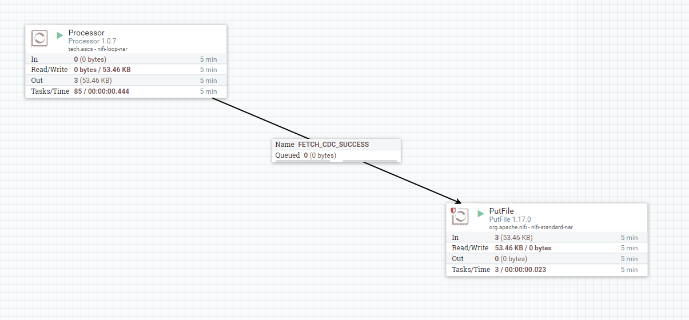
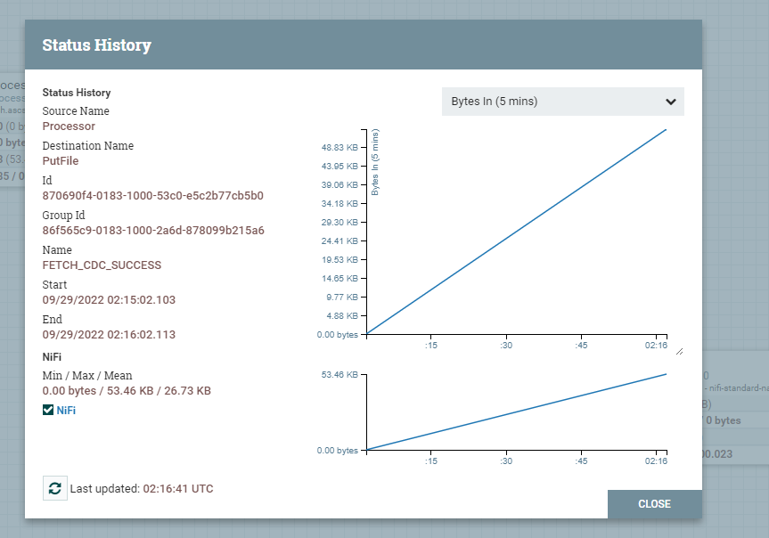

nifi 自定义processor开发 
===
> create by [afterloe](605728727@qq.com)  
> version is 1.0.0  
> MIT License

## 基础开发环境
* vscode java plugin
* docker 17
* nifi image 1.17
* jdk 1.8
* maven 3.8.6


## 工程初始化
### Maven构造
```bash
mvn archetype:generate

... 

Choose a number or apply filter (format: [groupId:]artifactId, case sensitive contains): 1960:

nifi

Choose archetype:
1: remote -> org.apache.nifi:nifi-processor-bundle-archetype (-)
2: remote -> org.apache.nifi:nifi-service-bundle-archetype (-)
Choose a number or apply filter (format: [groupId:]artifactId, case sensitive contains): : 

1

...
Choose org.apache.nifi:nifi-processor-bundle-archetype version:
53: 1.16.3
54: 1.17.0
Choose a number: 54:

54

Define value for property 'artifactBaseName': demo
[INFO] Using property: nifiVersion = 1.17.0
Define value for property 'groupId': tech.ascs
Define value for property 'artifactId': demo
Define value for property 'version' 1.0-SNAPSHOT: : 1.0.0
Define value for property 'package' tech.ascs.processors.demo: : prcessor
Confirm properties configuration:
artifactBaseName: demo
nifiVersion: 1.17.0
groupId: tech.ascs
artifactId: demo
version: 1.0.0
package: prcessor
 Y: : 
 
 y
 
[INFO] ----------------------------------------------------------------------------
[INFO] Using following parameters for creating project from Archetype: nifi-processor-bundle-archetype:1.17.0
[INFO] ----------------------------------------------------------------------------
[INFO] Parameter: groupId, Value: tech.ascs
[INFO] Parameter: artifactId, Value: demo
[INFO] Parameter: version, Value: 1.0.0
[INFO] Parameter: package, Value: prcessor
[INFO] Parameter: packageInPathFormat, Value: prcessor
[INFO] Parameter: package, Value: prcessor
[INFO] Parameter: version, Value: 1.0.0
[INFO] Parameter: artifactBaseName, Value: demo
[INFO] Parameter: groupId, Value: tech.ascs
[INFO] Parameter: artifactId, Value: demo
[INFO] Parameter: nifiVersion, Value: 1.17.0
[INFO] Project created from Archetype in dir: /home/afterloe/Projects/demo
[INFO] ------------------------------------------------------------------------
[INFO] BUILD SUCCESS
[INFO] ------------------------------------------------------------------------
[INFO] Total time:  02:34 min
[INFO] Finished at: 2022-09-28T09:58:34+08:00
[INFO] ------------------------------------------------------------------------
```

## 开发
### 作为数据源的processor开发
作为数据源，该processor不需要其他的nifi组件进行连接，自身可产生数据，类似于`GenerateFlowFile`, 在开发时候需要在类上添加特殊注解`@InputRequirement(Requirement.INPUT_FORBIDDEN)`，否则会出现flowFile获取异常的错误
```java
@Tags({})
@CapabilityDescription("")
@InputRequirement(Requirement.INPUT_FORBIDDEN)
@SeeAlso({})
@ReadsAttributes({ @ReadsAttribute(attribute = "", description = "") })
@WritesAttributes({ @WritesAttribute(attribute = "", description = "") })
public class Processor extends AbstractProcessor {

}
```
其次，在`onTrigger`方法上，每次需要进行create操作，不然是写不上数据的。
```java
                // 获取log类，实现将日志写入到nifi日志中，方便进行错误排查
                ComponentLog log = getLogger();
                // onTrigger 方法调用非常频繁，建议使用变量进行分隔
                if (!initEngine.get()) {
                        setUpEngine(context, session);
                } else {
                        String results = value.get();
                        if (results == null || results.isEmpty()) {
                                // 若不符合业务要求，直接调用yield方法跳过
                                context.yield();
                                return;
                        }
                        // 作为数据源的时候 FlowFIle是每次进行创建的。
                        FlowFile flowFile = session.create();
                        if (flowFile == null) {
                                initEngine.set(false);
                                log.error("create flowFile fail.");
                                return;
                        }
                        // 需要在flowFile attribute 添加 match 属性
                        flowFile = session.putAttribute(flowFile, "match", results);
                        // 向flowFile写入数据， 下游的processor获取的内容就是该步骤写入的内容
                        flowFile = session.write(flowFile, out -> {
                                byte[] content = value.get().getBytes();
                                out.write(content);
                                log.info(String.format("wrtie %d bytes to flowFile", content.length));
                        });
                        // 输出target 变量，让下游能够进行勾选，确定数据的输出渠道
                        session.transfer(flowFile, FETCH_CDC_SUCCESS);
                        // 这里使用手动commit的方法，其实在 AbstractProcessor 类中，他会自动调用 commit
                        session.commit();
                        // 写入成功后将控制量置空，避免重复写入数据
                        value.set("");
                }
```
源码可参考: https://github.com/afterloe/nifi-processor/blob/main/loop-nifi-processor

### 作为数据加工的processor开发
作为数据加工的processor，需要对上游传递的flowfile中读取数据，并进行处理，最后再写入到下游之中，默认通过`maven`方法创建的工程无需添加任何注解，即可进行开发。 核心`onTrigger`方法如下:
```java
        ComponentLog log = getLogger();
        // 从上游获取FlowFile
        FlowFile flowFile = session.get();
        if (flowFile == null) {
            return;
        }
        // 创建一个原子级暂存string的变量
        final AtomicReference<String> value = new AtomicReference<>();
        // 读取flowFile中的内容
        session.read(flowFile, in -> {
            try {
                StringWriter sw = new StringWriter();
                InputStreamReader inr = new InputStreamReader(in);
                char[] buffer = new char[1024];
                int n = 0;
                while (-1 != (n = inr.read(buffer))) {
                    sw.write(buffer, 0, n);
                }
                String str = sw.toString();
                
                // 模拟数据处理，对读取到的string进行修改, 并转换为json
                String result = "处理了：" + str + context.getProperty("MY_PROPERTY").getValue();
                final Map<String, String> jsonObj = new HashMap<String, String>();
                jsonObj.put("content", result);
                jsonObj.put("total", "1130");
                String jsonCode = JSON.toString(jsonObj);
                log.info(jsonCode);
                
                // 将结果同步到原子级变量中
                value.set(jsonCode);
            } catch (Exception ex) {
                ex.printStackTrace();
                getLogger().error("Failed to read json string.");
            }
        });

        // 读取原子级暂存string的变量
        String results = value.get();
        if (results != null && !results.isEmpty()) {
            // 需要在flowFile attribute 添加 match 属性
            flowFile = session.putAttribute(flowFile, "match", results);
        }
        // 将变动的数据写入flowFile中
        flowFile = session.write(flowFile, out -> out.write(value.get().getBytes()));
        // 输出target 变量，让下游能够进行勾选，确定数据的输出渠道
        session.transfer(flowFile, MY_RELATIONSHIP_SUCCESS);
```
源码可参考: https://github.com/afterloe/nifi-processor/blob/main/single-nifi-processor

## 打包
在项目根目录执行`mvn clean install`即可完成。
```
cd /some_path/processor-project-root
ls .
nifi-loop-nar  nifi-loop-processors  pom.xml  target
mvn clean install
```
> 不要为了省事到`*-nar`目录下执行命令，只有在根目录下执行才能同步修改内容。

## 上传nifi
```
cd /some_path/processor-project-root
ls .
nifi-loop-nar  nifi-loop-processors  pom.xml  target

cd nifi-loop-nar/target
ls .
classes  maven-archiver  maven-shared-archive-resources  META-INF  nifi-loop-nar-1.0.7.nar  test-classes
docker cp nifi-loop-nar-1.0.7.nar 9e54c:/opt/nifi/nifi-current/lib
```
> 将项目根目录下的`*-nar/target/*.nar`上传到nifi的`/nifi-current/lib`目录下即可，也能上传到`extensions`，两种选其一即可

## 测试
### junit测试

### 测试环境测试
```
docker restart 9e54c
docker logs -f 9e54c
```
> nifi需要重启才能完成从`lib`目录下加载nar，若是`extensions`，则无需进行重启。




## 常见bug
### Java Runtime only recognizes class file versions up to 52.0
nar包编译使用的java版本高于nifi编译的java版本，使用统一版本的jdk进行编译即可解决。
